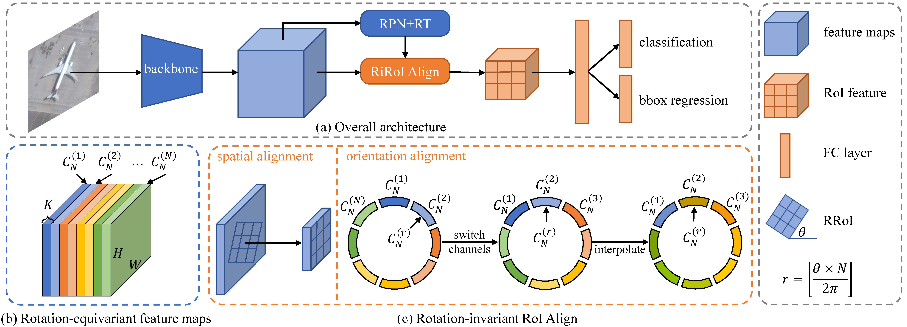

### ReDet: A Rotation-equivariant Detector for Aerial Object Detection



> **[ReDet: A Rotation-equivariant Detector for Aerial Object Detection (CVPR2021)](#)**,            
> Jiaming Han<sup>\*</sup>, Jian Ding<sup>\*</sup>, Nan Xue, Gui-Song Xia<sup>†</sup>,        
> arXiv preprint ([arXiv:2103.07733](https://arxiv.org/pdf/2103.07733.pdf)).

The repo is based on [AerialDetection](https://github.com/dingjiansw101/AerialDetection) and [mmdetection](https://github.com/open-mmlab/mmdetection).
[AerialDetection](https://github.com/dingjiansw101/AerialDetection) is a powerful framework for object detection in aerial images, which contains a lot of useful algorithms and tools.

### Introduction
Recently, object detection in aerial images has gained much attention in computer vision. Different from objects in natural images, aerial objects are often distributed with arbitrary orientation.
Therefore, the detector requires more parameters to encode the orientation information, which are often highly redundant and inefficient.
Moreover, as ordinary CNNs do not explicitly model the orientation variation, large amounts of rotation augmented data is needed to train an accurate object detector.
In this paper, we propose a Rotation-equivariant Detector (ReDet) to address these issues, which explicitly encodes rotation equivariance and rotation invariance.
More precisely, we incorporate rotation-equivariant networks into the detector to extract rotation-equivariant features, which can accurately predict the orientation and lead to a huge reduction of model size.
Based on the rotation-equivariant features, we also present Rotation-invariant RoI Align (RiRoI Align), which adaptively extracts rotation-invariant features from equivariant features according to the orientation of RoI.
Extensive experiments on several challenging aerial image datasets DOTA-v1.0, DOTA-v1.5 and HRSC2016, show that our method can achieve state-of-the-art performance on the task of aerial object detection.
Compared with previous best results, our ReDet gains 1.2, 3.5 and 2.6 mAP on DOTA-v1.0, DOTA-v1.5 and HRSC2016 respectively while reducing the number of parameters by 60% (313 Mb vs. 121 Mb).
## Changelog

* **2021-04-13**. Update our [pretrained ReResNet](https://drive.google.com/file/d/1FshfREfLZaNl5FcaKrH0lxFyZt50Uyu2/view) and fix by [this commit](https://github.com/csuhan/ReDet/commit/88f8170db12a34ec342ab61571db217c9589888d). For the users that can not reach our reported mAP, please download it and train again.
* **2021-03-09**. Code released.

## Benchmark and model zoo

* **ImageNet pretrain**

We pretrain our ReResNet on the ImageNet-1K. Related codes can be found at the [ReDet_mmcls](https://github.com/csuhan/ReDet/tree/ReDet_mmcls) branch. 
Here we provide our pretrained ReResNet-50 model for convenience. 
If you want to train and use ReResNet in your own project, please check out [ReDet_mmcls](https://github.com/csuhan/ReDet/tree/ReDet_mmcls) for the installation and basic usage.


|         Model                                               |Group      | Top-1 (%) | Top-5 (%) | Download |
|:-----------------------------------------------------------:|:---------:|:---------:|:---------:|:--------:|
| [ReR50](https://github.com/csuhan/ReDet/blob/ReDet_mmcls/configs/re_resnet/re_resnet50_c8_batch256.py) |C<sub>8</sub>| 71.20     | 90.28     | [model](https://drive.google.com/file/d/1FshfREfLZaNl5FcaKrH0lxFyZt50Uyu2/view?usp=sharing) &#124; [log](https://drive.google.com/file/d/1VLW8YbU1kGpqd4hfvI9UItbCOprzo-v4/view?usp=sharing)|


* **Object Detection**

|Model                      |Data           |    Backbone     |    MS  |  Rotate | Lr schd  | box AP | Download|
|:-------------:            |:-------------:| :-------------: | :-----:| :-----: | :-----:  | :----: | :---------------------------------------------------------------------------------------: |
|ReDet                      |DOTA-v1.0       |    ReR50-ReFPN     |   -    |   -    |   1x     |  76.25 |    [cfg](configs/ReDet/ReDet_re50_refpn_1x_dota1.py) [model](https://drive.google.com/file/d/1LCz-Q8PJkr-x9kJk7PcCy37W_cPAdmvO/view?usp=sharing) [log](https://drive.google.com/file/d/1OXgenH6YvtyRUwPH8h9f9p9tBCh60Kln/view?usp=sharing)      |
|ReDet                      |DOTA-v1.0       |    ReR50-ReFPN     |   ✓    |   ✓    |   1x     |  80.10 |    [cfg](configs/ReDet/ReDet_re50_refpn_1x_dota1_ms.py) [model](https://drive.google.com/file/d/1uJb75xTFmQu4db1X8NQKuRNNTrN7TtuA/view?usp=sharing) [log](https://drive.google.com/file/d/1reDaa_ouBfLAZj8Z6wEDsOKxDjeLo0Gt/view?usp=sharing)        |
|ReDet                      |DOTA-v1.5       |    ReR50-ReFPN     |   -    |   -    |   1x     |  66.86 |    [cfg](configs/ReDet/ReDet_re50_refpn_1x_dota15.py) [model](https://drive.google.com/file/d/1AjG3-Db_hmZF1YSKRVnq8j_yuxzualRo/view?usp=sharing) [log](https://drive.google.com/file/d/17dsP9EUbLTV9THkOAA3G3jpmIHHnj83-/view?usp=sharing)        |
|ReDet                      |DOTA-v1.5       |    ReR50-ReFPN     |   ✓    |   ✓    |   1x     |  76.80 |    [cfg](configs/ReDet/ReDet_re50_refpn_1x_dota15_ms.py) [model](https://drive.google.com/file/d/1I1IDmt3juw1sm-CT-zaosVVDldAHYBIO/view?usp=sharing) [log](https://drive.google.com/file/d/1T2Eou26T0mpmP93X_XrFk-AhSicLrgGp/view?usp=sharing)        |
|ReDet                      |HRSC2016        |    ReR50-ReFPN     |   -    |   -    |   3x     |  90.46 |    [cfg](configs/ReDet/ReDet_re50_refpn_3x_hrsc2016.py) [model](https://drive.google.com/file/d/1vTU6OeFD6CX4zkQn7szlgL7Qc_MOZpgC/view?usp=sharing) [log](https://drive.google.com/file/d/1csbm3jop9MGOQt8JaEeBg6TEXOZXY-yo/view?usp=sharing)        |

**Note:**
1. All our models are trained on 4GPUs with a learning rate 0.01. If you train your model with more/fewer GPUs, remember to change the learning rate, e.g., 0.02lr=0.0025lr\*8GPU, 0.0025lr=0.0025lr\*1GPU.
2. If you cannot get access to Google Drive, BaiduYun download link can be found [here](https://pan.baidu.com/s/1RowD1GchTQNfuEGvMmH6bQ) with extracting code **ABCD**.


## Installation

Please refer to [INSTALL.md](INSTALL.md) for installation and dataset preparation.


## Getting Started

Please see [GETTING_STARTED.md](GETTING_STARTED.md) for the basic usage.


## Citation

```
@inproceedings{han2021ReDet,
  author = {Han, Jiaming and Ding, Jian and Xue, Nan and Xia, Gui-Song},
  title = {ReDet: A Rotation-equivariant Detector for Aerial Object Detection},
  booktitle = {Proc. IEEE Conf. Computer Vision and Pattern Recognition (CVPR)},
  year = {2021}
}
```